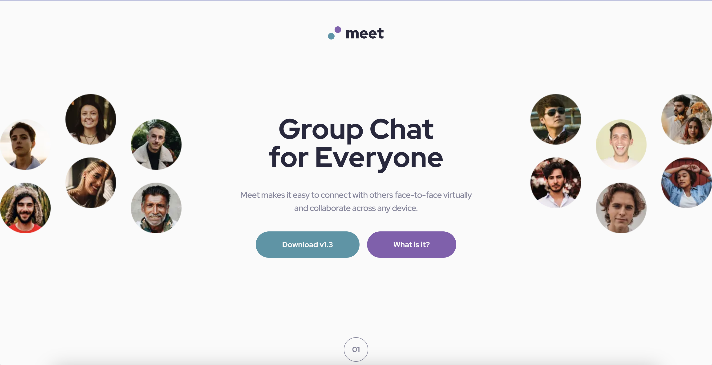

# Frontend Mentor - Recipe page solution

This is a solution to the [Recipe page challenge on Frontend Mentor](https://www.frontendmentor.io/challenges/recipe-page-KiTsR8QQKm). Frontend Mentor challenges help you improve your coding skills by building realistic projects. 

## Table of contents

- [Overview](#overview)
  - [Screenshot](#screenshot)
  - [Links](#links)
- [My process](#my-process)
  - [Built with](#built-with)
- [Author](#author)
- [Acknowledgments](#acknowledgments)

## Overview

### Screenshot



### Links

- Solution URL: [(https://github.com/Kofiastro/Recipe-Page.git)]
- Live Site URL:[(https://zesty-syrniki-b86d5b.netlify.app/)]

## My process
Using Tailwindcss i have been able to work on designs much faster and i want to learn more by working on more projects at frontendmentor to help me be good at it.

### Built with

- TailwindCss and NextJs framework

### What I learned
adding mutiple backkground images according to each media breakpoint using NEXTJS


```html
    <Image fill src={"/desktop/image-footer.jpg"} className='sm:hidden md:hidden lg:block  opacity-30 mix-blend-overlay object-cover '/>
    <Image fill src={"/tablet/image-footer.jpg"} className='sm:hidden md:block lg:hidden opacity-30 mix-blend-overlay object-cover '/>
    <Image fill src={"/mobile/image-footer.jpg"} className=' sm:block md:hidden lg:hidden opacity-30 mix-blend-overlay object-cover '/>
```

## Author

- Frontend Mentor - [@Kofiastro](https://www.frontendmentor.io/profile/kofiastro)

## Acknowledgments

Big thanks to Traversy Media and the frontendmentor team 🎉

